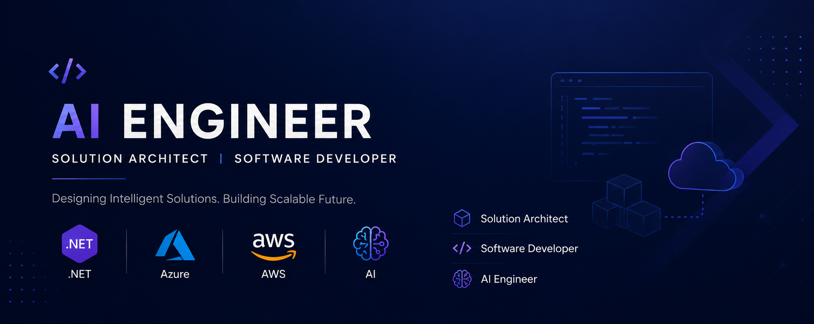

## Hi there! 👋 I'm Maisam — Software & AI Engineer

- 🤖 Currently building AI-powered applications with LLMs, agents, and RAG pipelines
- 🌐 Crafting full-stack solutions with modern web technologies
- ☁️ Deploying and scaling applications on AWS & Azure
- 🔍 Exploring the intersection of AI and real-world software engineering
- 💬 Ask me about AI engineering, .NET, or React
- 📫 Reach me at [maisam.razai@outlook.com](mailto:maisam.razai@outlook.com)

---

## 🛠️ Tech Stack

  

  

---

## 🚧 Projects

> More projects coming soon — stay tuned!

| Project | Description | Tech | Status |
|---|---|---|---|
| 🔒 Coming Soon | AI-powered application | `Python` `LLMs` | 🛠️ In Progress |
| 🔒 Coming Soon | Full-stack web app | `React` `.NET` | 📋 Planned |
| 🔒 Coming Soon | Cloud-native tool | `Azure` `Docker` | 📋 Planned |

---

## 📊 GitHub Stats

  

  

